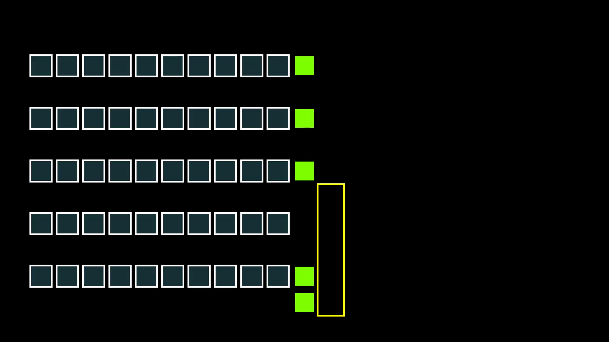

<h2>Fleet charge optimization with reinforcement learning.</h2>
<h3>Motivations</h3>

Lithium batteries have several environmental side effects:

<ul>
    <li>
        <a class="inline_disabled" href="https://www.wired.co.uk/article/lithium-batteries-environment-impact" target="_blank" rel="noopener">Lithium Mining causes groundwater depletion, and, if not managed properly, water contamination</a>
        <ul>
            <li>
                <a class="inline_disabled" href="https://www.nsenergybusiness.com/features/lithium-ion-battery-environmental-impact/" target="_blank" rel="noopener">It takes nearly 2,000 tons of water to produce a single ton of lithium</a>
            </li>
        </ul>
    </li>
    <li>
        <a class="inline_disabled" href="https://www.wired.com/story/the-race-to-crack-battery-recycling-before-its-too-late/" target="_blank" rel="noopener">Lithium batteries have an incredibly low recycle rate, and even when they are recycled, the process damages the environment further</a>
        <ul>
            <li>Pyrometallurgy (cheap but not good), acidic Hydrometallurgy (expensive and still not great)
            </li>
        </ul>
    </li>
</ul>

    From an environmental perspective, we'd like to limit the replacement of these batteries if at all possible.

    From a business perspective, batteries are expensive, and limiting replacements is good for them as well.

<h3>
    Problem Definition
</h3>

    Given a shipping warehouse (like Amazon's) with automated shelf robots, find the optimal charging policy such that battery health is conserved without significant damages to profit.

<h3>
    Solution Method
</h3>

    Reinforcement learning coupled with a custom simulator.

Simulator:

    The simulator operates as such: given a warehouse of a certain size with a certain number of robots and chargers, and a decision policy (either static or AI), simulate picking shelves for human pickers and recharging robots when requested by the policy. The simulation proceeds in a number of steps: in each step, the next currently idle robot chooses it's next action according to the policy, and executes that action.

    The simulator does not perform collision avoidance, as that is really just a constant factor onto the amount of movement needed to make an item pick, and is largely influenced by warehouse design. It will, however, prevent two robots from occupying the same charger.

    The policy is driven by a reinforcement learner, which is trying the learn the value function

`Q(s,a)=E[R|s,a,\pi]`

    where
        `s` is the state,
        `a` is the action to take, and
        `Q(s,a) is the expected reward from following action `a` at state `s` and following the "optimal" policy `\pi` thereafter. This is learned through memory of previous actions, and what rewards they lead to over time.
    

The state `s` is given as an array of `\{\text{charge},\text{charge_rank},\text{battery_health},\text{chargers_available}\}`. This state representation gives the policy the information on both what to do with this robot, but what decision it should make based on the rest of the fleet.

    The actions that the policy may choose are: charge 5% (it may choose this action repeatedly to continue charging in one go), pick an item, or idle.

The reward function is given by
        `R(s,a)=-50000\cdot\operatorname{damage}(s,a)+\begin{cases}
1&amp;\text{if } a = \text{ fetch_item }\\
0&amp;\text{otherwise}
\end{cases}`

    The reward function essentially calculates net profit for performing the given action: we put a $10,000 penalty for replacing the batteries, and they need to be replaced at 80%, so we calculate the additional damage of performing this action and add it to the potential revenue of performing this action. Obviously, Amazon's revenue numbers are a tightly guarded secret, but most estimates based on Fulfillment by Amazon pricing put it at around $1/pick.

    Damage is calculated by comparing the battery health of the next state with the battery health of the current state. As for how battery health is calculated, it is an extremely complex equation designed by Dr. Millner of MIT. <a class="inline_disabled" href="https://ieeexplore-ieee-org.dist.lib.usu.edu/stamp/stamp.jsp?tp=&amp;arnumber=5619782" target="_blank" rel="noopener">You can read more about it here</a>.

<h3>
    Results
</h3>

Here are three runs of the simulator: the first with a [random policy applied](./animation/random.mp4), the second after [90 simulation days of training](./animation/trained.mp4), and the third is the same as the second, just starting [at minute 90 instead of minute 0](./animation/trained_oncharger.mp4). The simulations are visualized at 3x speed.

<h3>
    Conclusions
</h3>

    This approach seems quite feasible to optimize the environmental impact of the robot batteries. Further steps on this would be to join this with other projects that optimize warehouse design and robot path planning to both decrease energy costs and learn a policy based more on realistic conditions rather than our idealized model.

    New skills learned:

<ul>
    <li>
        A much better understanding of reinforcement learning than I had previously
    </li>
    <li>Visualization tools in Python (matplotlibs for the graphs is not super new, but <a class="inline_disabled" href="https://github.com/ManimCommunity/manim/" target="_blank" rel="noopener">manim</a> for the animations certainly was)</li>
</ul>
